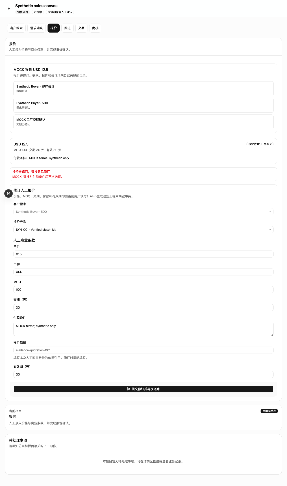
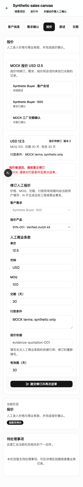
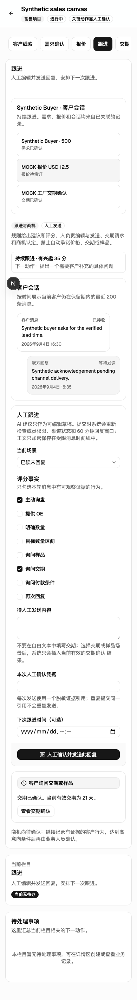

# 客户需求、报价与跟进的连续旅程

关联：#403、[ADR 0007](../decisions/0007-task-oriented-workspace.md)，属于 #394 的第 4 批。仅使用隔离数据库、合成客户、合成工厂凭据和模拟发送回执。

## 页面行为

- 客户会话、客户需求、报价、交期详情显示实际关联记录。只根据保存的关系建立连接，不根据同属一个项目猜测客户身份。多个报价全部列出，不自动挑选第一条。
- 客户需求分为新建、列表和详情。指定来源会话后固定来源；已有需求直接继续原记录。缺失字段使用业务名称，确认完整后可进入关联报价。
- 报价展示条款、版本、审核状态和退回理由；有审核权限的项目编辑者处理审核，其他成员看到等待说明。登记发送凭据后进入返回的实际客户会话。
- 客户跟进以消息和本次回复为主。工厂交期申请按需展开；满足意向条件后才展示人工商机确认。等待、拒绝和过期交期分别说明原因，历史确认不等于当前可以承诺。
- 修改过的表单使用共享校验、字段错误和离开保护。页面导航使用真正的链接，保存成功后清理相应表单的未保存状态。

## 读取边界

合成 PostgreSQL 复现了旧读取逻辑中的不一致：会话关联错误时，回复权限为否，但消息正文仍可读出。现在在获取密文之前同时检查项目成员关系、项目中的客户记录和会话反向绑定；错误引用不会进入解密。

列表不读取消息正文。详情只读取指定客户最近 200 条未删除、未过期消息，按时间顺序展示，并在截断时明确提示。其他客户的消息量不会占用当前客户的额度。

可用于回复的交期摘要须同时满足当前项目拥有该确认和需求、确认对应同一需求、状态已确认且有效期未到。错误需求、错误实体类型、过期或项目外记录不产生可用摘要。客户需求列表移除旧的 50 条截断，较早的精确记录仍可访问。

没有修改人工报价/交期事实权限、证据要求、审核版本检查或受控回复发送契约。过期交期当前提示联系工厂重新核对，本批没有新增续期工作流。

## 验证范围

- 关系模型：不同客户隔离、关系冲突、缺失上游、多份报价、手工需求的发送后回链。
- PostgreSQL：编辑者/只读成员、非成员与撤销成员、错误会话引用不可解密、消息保留与最近 200 条、51 条需求、交期归属/需求匹配/有效期。
- 浏览器：手工需求及入站客户两种起点，真实表单创建需求 → 补充 → 确认 → 报价 → 退回/修订/批准 → 登记发送 → 跟进 → 工厂交期确认 → 人工商机确认；核对六种跟进场景、加密消息和排队任务。陈旧审核与错误请求不得写入。
- 路由：精确记录、旧地址、来源固定、权限/只读/归档、无效标识、返回列表、手机宽度和未保存提示。

本地类型检查、格式检查、仓库校验、客户关系、报价、需求、交期和工作区导航契约检查通过。PostgreSQL 边界测试通过；11 项任务入口检查、两种起点的完整销售流程，以及 13 项界面检查通过。已有客户保存需求后会进入该需求的精确地址；任务入口的列表不再自动打开第一条记录。

Next 开发运行时的编译与运行错误为空。React 树中的客户上下文、报价编辑器和未保存保护根各只有一个。报价修订页（桌面、390px）和展开交期的跟进页 axe 检查均为零违规、零待人工复核项。

模拟回执只验证登记和受控排队，不代表真实渠道已发送。[PR #404](https://github.com/ban12-project/F-Trade-Platform/pull/404) 最终 CI 的 189 项界面测试、38 项数据库浏览器测试全部首次通过；全部检查成功后合并为 `a899cc1`。[完整运行记录](https://github.com/ban12-project/F-Trade-Platform/actions/runs/35446212182)。

## 合成界面截图

以下为本批编辑区域，测试页保留项目栏目外壳；实际全局任务导航见第 2 批验证记录。左下角开发工具入口不出现在生产界面。

