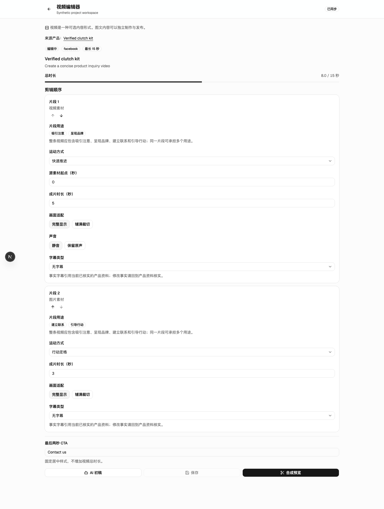
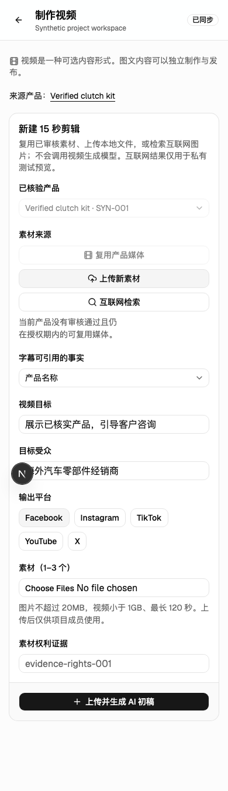

# 可选视频的入口与上下文

关联：#405、[ADR 0007](../decisions/0007-task-oriented-workspace.md)，属于 #394 的最后一批。只使用合成记录和隔离测试数据库。

## 页面行为

- 项目视频地址默认列出可选择的剪辑稿，不自动打开第一条。新建明确使用 `new=1`；`item` 只打开指定记录；旧的 `product` 来源链接继续有效。
- 无效标识、重复参数、冲突目标和其他项目的对象显示不可用，不打开替代记录或空白写入表单。
- 视频标明为可选内容形式。返回入口指向当前项目的“内容与发布”，来源链接指向实际产品。缺少已核实产品时可以直接返回本项目产品资料。
- 创建指定产品的视频会固定来源；未指定且有多个产品时需要明确选择。指定产品的新建页不展示其他产品的复制入口。
- 复制或创建成功后，通过服务端返回的 ID 打开新稿。复制动作不清除旁边尚未提交的新建输入。连续保存编辑稿后清理对应未保存状态。
- 编辑稿、审核证据、新建输入和上传中的素材使用共同的离开保护；来源链接、返回入口与全局导航都经过该保护。
- 只读成员与归档项目在界面上禁用编辑控件并隐藏审核按钮。无审核权限时说明等待角色；私有预览和已批准作品的下载保留原有服务端边界。

## 验证

真实数据库浏览器检查覆盖多记录列表/详情/新建、旧来源地址、无效与跨项目目标、实际复制的新 ID、连续两次保存、只读与归档、390px 下取消离开并保留输入。私有预览/下载的 PostgreSQL 边界检查覆盖成员、非成员、管理员越权、撤销成员与错误归属，拒绝请求不读取私有存储。

纯查询契约、工作区导航、类型/格式/仓库检查通过；16 项视频/素材/工作台界面检查和 5 项数据库浏览器检查通过。新建页与编辑页在桌面和 390px 下的 axe 检查均为零违规、零待人工复核项。Next 开发运行时无编译或运行错误；React 树中的编辑器、新建表单与未保存保护根各按当前页面只出现一次。

最终完整 CI 以本批关联 PR 的检查记录为准；必须全部通过后才能合并。

归档后的服务端冻结规则并未在本批实现：原有授权按成员、角色和对象归属判断，尚未统一检查归档状态；详见 [Decision/Risk #407](https://github.com/ban12-project/F-Trade-Platform/issues/407)。归档界面检查不能当作全域写入冻结的证据。

未运行实际视频生成或外部发送。合成检查不能证明真实渠道资格、真实工厂资料正确性或真实用户使用满意度。

## 合成界面截图

以下仅展示视频编辑区域；真实路由中的全局导航与权限由数据库浏览器检查覆盖。左下角为开发工具入口，不出现在生产界面。

