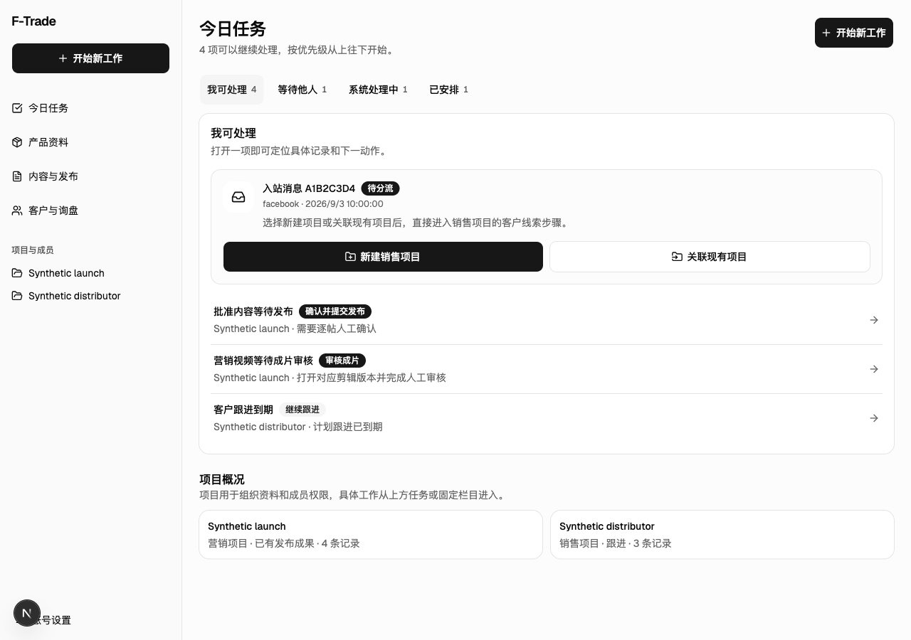
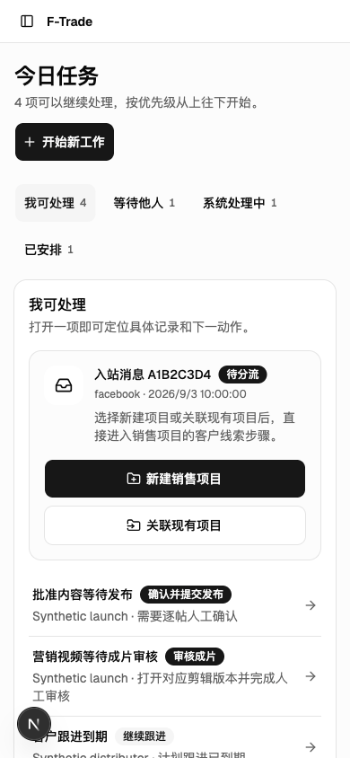

# 任务首页与固定栏目验证

关联：#399、[ADR 0007](../decisions/0007-task-oriented-workspace.md)。所有画面与数据库记录均为合成数据。

## 可观察结果

- 首页只有一个任务清单，通过状态切换查看我可处理、等待他人、系统处理中和已安排。
- 390px 首屏可以开始新工作，也能看到第一批可处理事项。新工作先选择业务意图，再明确已有项目或创建新的归属范围。
- 侧栏/移动导航保持挂载，页面主体只渲染一次。项目编辑在主要内容区，相关任务随后或在宽屏辅助栏呈现。
- 产品、内容/发布、客户/询盘列表按成员范围读取。引用产品保持只读；不存在或不可访问的项目筛选不会变成全部项目。
- 对象地址可以刷新、返回、前进；历史查询参数链接继续工作。错误 ID、矛盾参数及项目外记录显示不可用。

## 验证方式

```sh
pnpm test:workspace-navigation
pnpm typecheck
pnpm check:ci
python3 scripts/validate_repository.py
pnpm exec playwright test tests/e2e/workspace-dashboard.spec.ts tests/e2e/workspace-navigation.spec.ts tests/e2e/project-workflow.spec.ts
pnpm exec playwright test -c playwright.database.config.ts tests/database-browser/task-destinations.spec.ts tests/database-browser/project-instant.spec.ts tests/database-browser/sales.spec.ts
```

数据库浏览器检查仅使用 `playwright.database.config.ts` 指定的隔离合成数据库。覆盖新工作复用/新建、跨项目与只读引用、角色变更、旧链接、审核/修订/回执任务、完整销售闭环及静态壳 hard/soft navigation。导航测试保留草稿取消/放弃，以及窗口与底层页面的独立保护。

开发运行时通过 Next MCP 检查编译与运行错误；React 树中仅有一个 WorkspaceShell、WorkspaceDirtyRoot 和 WorkspaceDashboard。桌面及 390px 首页的 axe 检查为零违规。新工作窗口的 axe 未报告违规，但对模态层背后的焦点隔离给出人工复核项；数据库浏览器测试以连续 Tab 操作检查焦点留在新工作窗口内。

以下是开发模式实拍，左下角开发工具入口不会进入生产界面。图片不证明真实工厂数据、真实渠道发布资格或真人可用性试用已经验收。

## 桌面



## 手机


